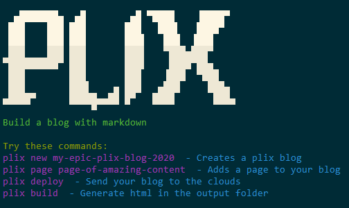

[meta-date]: <> (2019-10-29T11:44:46.073Z)
[meta-title]: <> (Page Title)

# PLIX for cake? 🍰
## Markdown driven blogging
### Delete this content and replace it with your own

[](https://www.npmjs.com/package/plix)
[](https://github.com/leenattress/plix#readme)
[](https://github.com/leenattress/plix/graphs/commit-activity)
[](https://github.com/leenattress/plix/blob/master/LICENSE)
[](https://twitter.com/leenattress)

> Minimal markdown blog builder.




### 🏠 [Homepage](https://github.com/leenattress/plix)

## Install (You've probably already done this)

```sh
npm i plix -g
```

## Help

```sh
plix help
```

## Create a plix blog

```sh
plix new my-fabulous-blog
cd my-fabulous-blog
```

## Create a plix page

```sh
plix page my-first-page
```

## Build

```sh
plix build
```

## Deploy

```sh
plix deploy
```

## Author

👤 **Lee Nattress <leenattress1981@gmail.com> (http://leenattress.com)**

* Twitter: [@leenattress](https://twitter.com/leenattress)
* Github: [@leenattress](https://github.com/leenattress)

## 🤝 Contributing

Contributions, issues and feature requests are welcome!

Feel free to check [issues page](https://github.com/leenattress/plix/issues).

## Show your support

Give a ⭐️ if this project helped you!


## 📝 License

Copyright © 2019 [Lee Nattress <leenattress1981@gmail.com> (http://leenattress.com)](https://github.com/leenattress).

This project is [ISC](https://github.com/leenattress/plix/blob/master/LICENSE) licensed.

***
_This README was generated with ❤️ by [readme-md-generator](https://github.com/kefranabg/readme-md-generator)_
